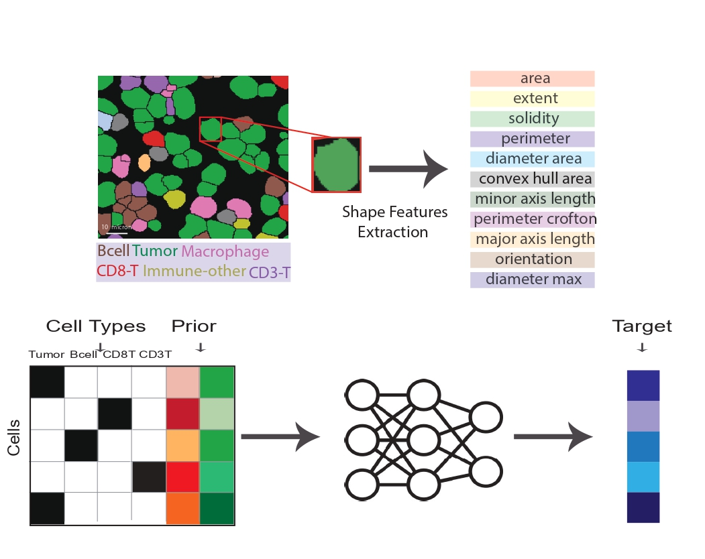

# Shape-Expression Modeling

A bidirectional machine learning framework for modeling the interplay between single cell shape and protein expression, based on our paper -  [Data-modeling the interplay between single cell shape, single cell protein expression, and tissue state](https://www.biorxiv.org/content/10.1101/2024.05.29.595857v1). The framework combines spatial multiplexed single-cell imaging data with machine learning to explore the relationships between cell morphology and protein expression in both directions.



## Features

- **Bidirectional modeling**: Shape → Protein expression AND Protein → Shape
- **Multiple model types**: Linear Models and Fully-connected netword
- **Statistical rigor**: Uses Adjusted R² to account for feature count
- **Per-patient analysis**: Individual patient-level performance evaluation
- **Command-line interface**: Easy-to-use CLI with extensive configuration options

## Installation

```bash
# 1. Clone and navigate
git clone https://github.com/zaritskylab/shape-exp-modeling.git
cd shape-exp-modeling

# 2. Create and activate environment
conda create -n shape_exp python=3.10.9
conda activate shape_exp

# 3. Install dependencies
pip install -r requirments.txt

```

## Data Requirements

The framework requires processed single cell CSV data with:
- **SampleID**: Patient/sample identifier
- **CellType**: Cell type classification  
- **Shape features**: Morphological measurements (e.g., cellSize, perimeter, solidity)
- **Protein markers**: Expression levels of functional proteins

See the [data/README.md](data/README.md) for more detailes.

## Basic Usage

```bash
# Shape → Protein
python main.py --data_path data/ProcessedCellsTNBC_sample.csv --direction shape2pro

# Protein → Shape 
python main.py --data_path data/ProcessedCellsTNBC_sample.csv --direction pro2shape
```

## Project Structure

```
shape-exp-modeling/
├── README.md                    # This file
├── requirements.txt             # Package requirements
├── main.py                     # Main CLI script
├── Exp2Shape/                  # Experiment to shape analysis
│   ├── analyze
│   ├── buildData.py
│   └── mainBaseline.py
├── GCN/                        # Graph Convolutional Network implementation
│   ├── Data.py
│   ├── models.py
│   ├── train_eval.py
│   └── utils.py
├── Images/                     # Image assets
├── Shape2Exp/                  # Shape to expression analysis
│   ├── ProcessData.py
│   ├── Shape2Exp_Demo.ipynb
│   ├── main.py
│   ├── models.py
│   └── utils.py
└── data/                       # Data directory
```


## Contributing

1. Fork the repository
2. Create a new branch (`git checkout -b feature-branch`)
3. Make your changes
4. Add tests for new functionality
5. Commit your changes (`git commit -m 'Add some feature'`)
6. Push to the branch (`git push origin feature-branch`)
7. Open a pull request

## Citation

If you use this implementation in your research, please cite:

```bibtex
@article{shape_exp_modeling2024,
  title={Data-modeling the interplay between single cell shape, single cell protein expression, and tissue state},
  author={Tamir, Yuval and Bussi, Yuval and Owczarek, Claudia and Luque, Luciana and Torrisi, Giuseppe and Rose, Leor Ariel and Kliper-Gross, Orit and Sander, Chris and Schumacher, Linus and Parsons, Maddy and Keren, Leeat and Zaritsky, Assaf},
  journal={bioRxiv},
  year={2024},
  url={https://www.biorxiv.org/content/10.1101/2024.05.29.595857v1}
}
```

## License

This project is licensed under the MIT License - see the [LICENSE](LICENSE) file for details.
